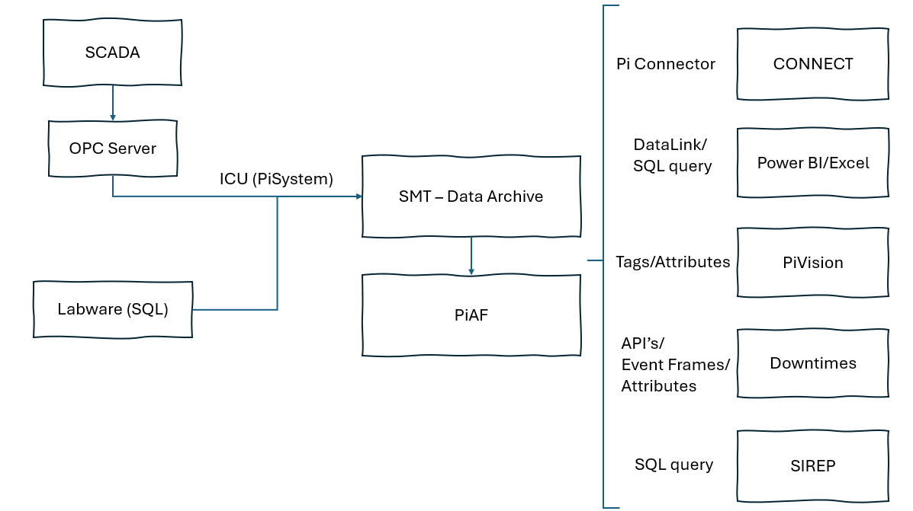

# PI System Optimization and Dashboards

**PI System** is a platform that centralizes data from multiple sources and is widely used in industrial environments due to its versatility. In my previous role, I was responsible for ensuring its proper deployment. Although the system was already in place, it was only partially used and, in some aspects, running under suboptimal conditions.

PI System serves as an interface for reporting across different OT systems. In this case, most data was retrieved from the **Schneider SCADA system**. While connectors between PI System and SCADA were installed, issues such as unreliable OPC connections reduced performance. Signal management also needed attention: many tags were duplicated, unused, or missing equipment data. Through optimization, we reduced tags from **1,990 to 1,340**, eliminating redundancies, removing unused tags, and adding key processing plant equipment.

Additionally, the **PI Asset Framework (PI AF)** — the structure where analyses are built and official reports rely on — lacked organization. Overall, the tool was underutilized, and there was clear room for improvement.

The work carried out focused on:

* Developing **real-time dashboards** in PI Vision.
* Organizing PI AF for consistent and reliable reporting.
* Setting up automatic notifications triggered by low productivity.
* Implementing new AVEVA technologies such as **CONNECT**.
* Supporting executive and operational decision-making with better-structured data.

---

## PI System Relevance and Data Flow

For the crushing and processing plants, PI System centralized data from **SCADA** and **Labware**. This included flows, grades, tonnage, and reagent consumption.

Not all variables were processed the same way:

* Some were stored directly as raw values from the original source.
* Others required calculations, such as adjustments for humidity or weighted averages.

These processes were handled within PI System modules such as ICU, SMT, PI AF, and PI Web API.

---

## PI Vision

After cleaning and restructuring tags, I created a **replica of the Crushing Plant SCADA** in PI Vision and **Production Dashboards**. This allowed users to:

* Access plant data without overloading the SCADA server via AnyDesk.
* Use dashboards for production values, availability, utilization, energy consumption, flows, grades, and stockpile levels.

---

## Downtimes

Using **Event Frames**, we were able to track equipment failures and productivity losses. A third-party application, *Downtimes*, was integrated with PI System via APIs to display and analyze these events on a more user-friendly platform.

I participated in designing the logic behind downtime triggers. Challenges included the complexity of the production line, which alternated between series and parallel systems. In some cases, multiple variables such as temperature and pressure had to be combined to correctly identify downtime causes.

The final workflow was:

1. Events triggered in PI System.
2. Information passed to *Downtimes* via APIs.
3. Context added by supervisors and operators.
4. Data analyzed by managers.

---

## CONNECT Integration

When AVEVA acquired OSIsoft, new technologies became available to enhance PI System. During my tenure, we integrated **CONNECT**, enabling:

* Cloud-based dashboards.
* An embedded AI assistant for analysis.
* Expanded efficiency monitoring (e.g., ADR Plant reactors).

This deployment required overcoming data connectivity challenges, mapping process signals, and **standardizing laboratory sample names**. The benefits extended beyond CONNECT:

* PI Vision dashboards gained consistency.
* Excel reports became easier to generate.
* SQL queries to Labware were simplified, enabling pivoting in Power Query.

---

## Official Reporting

My in-depth knowledge of the data infrastructure proved valuable when troubleshooting discrepancies in official reporting. Any change in the calculations could be discussed and updated as needed.  

